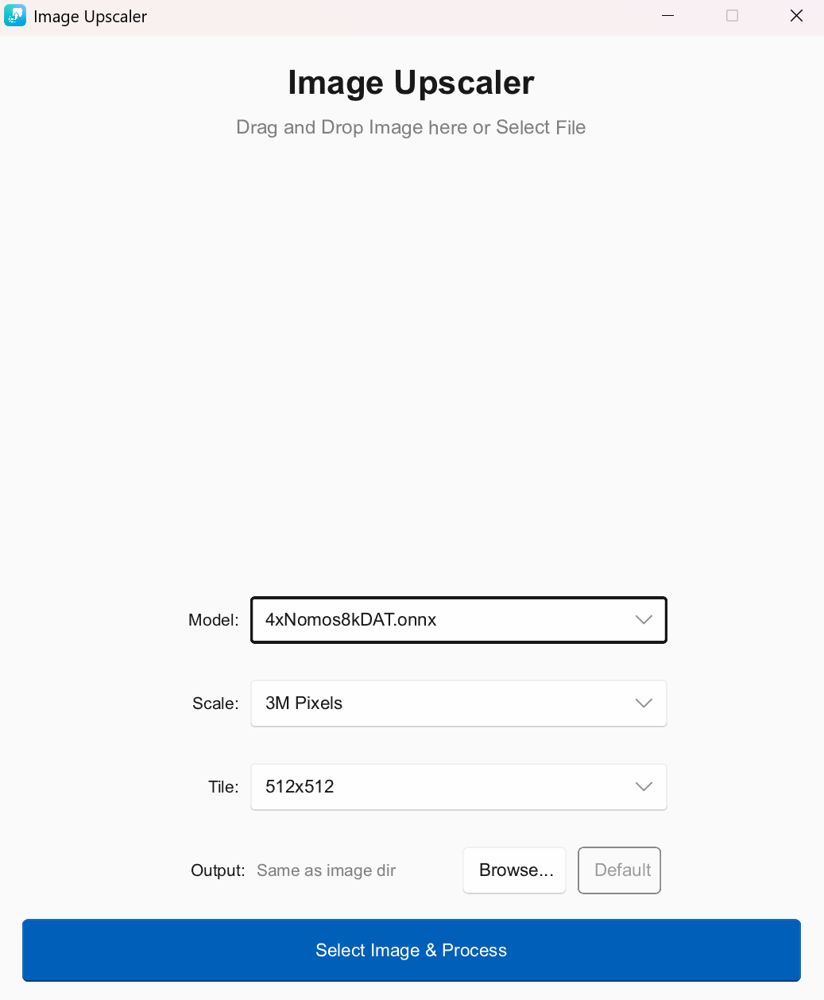

# 🚀 Rust ONNX Image Upscaler

A high-performance image upscaling application written in **Rust**, powered by **ONNX Runtime** and **Slint UI**. This app is designed for Windows and utilizes **DirectML** for GPU acceleration across NVIDIA, AMD, and Intel graphics cards.


 

## ✨ Key Features

- **⚡ High-Performance GPU Acceleration**: Leverages **DirectML** (DirectX 12) for universal GPU support on Windows. No complicated CUDA/cuDNN setup required.
- **🧩 Intelligent Tiling System**: Automatically splits large images (e.g., Ultra-HD wallpapers) into smaller tiles to prevent GPU Out-of-Memory (OOM) errors. Seamlessly reassembles tiles with zero artifacts.
- **🚀 Ultra-Fast File Saving**: Custom optimized PNG encoder implementation that significantly reduces CPU time during final image saving, especially for high-resolution 4x outputs.
- **🖼️ Batch Processing & Drag-n-Drop**: Easily drag and drop multiple images or folders directly onto the app window for sequential processing.
- **🎨 Modern & Responsive UI**: Built with the **Slint** framework for a sleek, lightweight, and native Windows experience.
- **📏 Flexible Output Scaling**: Supports multiple output targets (Original x2, x3, x4 or specific pixel counts like 1MP to 6MP).

---

## 🛠️ Requirements

- **OS**: Windows 10/11 (with DirectX 12 support).
- **Models**: `.onnx` model files (e.g., Real-ESRGAN or DAT converted to ONNX).
- **GPU**: NVIDIA, AMD, or Intel GPU that supports DirectML.

---

## 🚀 Getting Started
### 📥 Download
You can download the latest version from the [Releases Page](https://github.com/kirinonakar/rust_upscaler/releases).

### 1. Model Setup
Place your `.onnx` upscaling models in the **root directory** of the application. The app will automatically scan for and list them in the model selection menu.

**Recommended models**: 
- Real-ESRGAN_x4plus
- Real-ESRGAN_x4plus_anime_6B
- 4xNomos8kDAT

### 2. Running the App
For the best performance, always run in **release** mode:
```bash
cargo run --release
```

### 3. Processing Images
1.  Launch the application.
2.  Select your desired **ONNX Model** from the dropdown.
3.  Choose the **Output Scale** (e.g., x4).
4.  **Drag and Drop** your images onto the window or use the file picker.
5.  Check the progress bar and wait for the "Processing completed!" message.

---

## 🔧 Technical Overview

This project is built using a modern Rust stack:
*   **[Slint](https://slint.dev/)**: Reactive UI framework for the frontend.
*   **[ort](https://github.com/pykeio/ort)**: High-performance ONNX Runtime bindings for inference.
*   **[image-rs](https://github.com/image-rs/image)**: Image decoding and encoding.
*   **[DirectML](https://docs.microsoft.com/en-us/windows/ai/directml/dml-intro)**: Windows-native machine learning acceleration.

---

## 🔦 Optimization Details

- **Memory Management**: Images are normalized and converted to tensors on the fly. Heavy tensors are kept on the GPU as much as possible to minimize data transfer latency.
- **Fast PNG Compression**: We utilize the `image` crate's `PngEncoder` with `CompressionType::Fast` and `FilterType::NoFilter` to avoid the "PNG bottleneck" common in high-resolution upscaling apps.
- **Process Decoupling**: Inference runs on a dedicated background thread to keep the Slint UI responsive and prevent "App Hangs."

---

## 📜 License

This project is licensed under the MIT License - see the [LICENSE](LICENSE) file for details.

---

*Enjoy crystal-clear images with Rust! 🦀✨*
